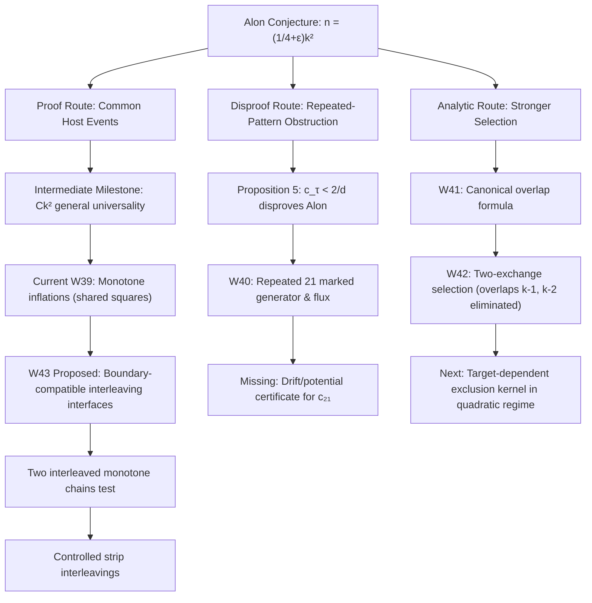

# Resuming Work on Proving Noga Alon's $k$-Superpattern Conjecture

This plan establishes the next phase of collaborative research on Noga Alon's random-superpattern conjecture in this repository:
$$\lim_{k \to \infty} \Pr\left(\sigma_n \text{ contains every } \pi \in S_k\right) = 1 \quad \text{for } n = \left\lceil\left(\frac{1}{4}+\varepsilon\right)k^2\right\rceil, \; \forall \varepsilon > 0.$$

It builds directly upon the established ledger in [memory/RESULTS.md](file:///Users/adamhadani/Development/math-proofs/superpatterns/memory/RESULTS.md), the strategic priorities in [memory/ALON-STRATEGY.md](file:///Users/adamhadani/Development/math-proofs/superpatterns/memory/ALON-STRATEGY.md), and the recent workstreams W39 (shared squares for monotone inflations), W40 (exact repeated-21 frontier & obstruction criterion), W41 (exact canonical overlap integrals), and W42 (two-exchange selection & finite target-dependence counterexample).

---

## User Review Required

> [!IMPORTANT]
> **Priority Alignment**: Per [memory/ALON-STRATEGY.md](file:///Users/adamhadani/Development/math-proofs/superpatterns/memory/ALON-STRATEGY.md), the user prioritized proving or disproving Alon over publication polish or minor constant optimization.
>
> The primary intermediate milestone on the **proof route** is:
> **General simultaneous universality at $C k^2$ for an absolute constant $C$**, closing the remaining $\log \log k$ factor from He–Kwan's $2000 k^2 \log \log k$ [arXiv:1911.12878](https://arxiv.org/html/1911.12878).
>
> We propose launching **Workstream W43: Boundary-Compatible Interleaving Interfaces**.
> Below, we detail W43 and list two alternative directions (W43-Route 2: repeated-21 marked drift, and W43-Route 3: W42 target-dependent exclusion kernel) should you prefer to explore the disproof/analytic routes first.

> [!WARNING]
> **Non-Negotiable Repo Norms (from [CLAUDE.md](file:///Users/adamhadani/Development/math-proofs/superpatterns/CLAUDE.md))**:
> 1. **No unverified claims**: Every combinatorial lemma must be tested against exhaustive finite checks; every theorem must be fully proved; no heuristic limits treated as proved thresholds.
> 2. **Avoid known dead ends**: As recorded in W14, W18, and W34, we must not:
>    - Rely on chain statistics alone over interleaving words (W14 entropy lemma was false).
>    - Assume independence or harmless lag between threads (W18 coalescence makes second threads lose linear lag).
>    - Use unconditioned stationary means without controlling conditional revisit gaps (W34 repaired by $H_\eta$).
>    - Hide a union bound over $k!$ targets inside an individual-target concentration bound.

---

## Strategic Roadmap & Proposed W43 Scope



### Proposed Workstream W43: Boundary-Compatible Interleaving Interfaces

The fundamental barrier to proving $O(k^2)$ universality is that known embedding methods handle either:
1. Purely quasirandom targets (He–Kwan thread method, $72k^2$ in W9/W13); or
2. Purely structured inflations (W39 shared squares, where monotone blocks of length $\ge K\sqrt{\log k}$ embed simultaneously into a polynomial family of $(k+1)^3$ host squares).

Real permutations interleave structured and quasirandom components. Embedding both components somewhere in the host is insufficient; they must glue together without violating coordinate ordering.

#### Mathematical Plan for W43:
1. **Model Problem: Two Interleaved Monotone Chains**:
   - Let $\pi$ be a permutation partitioned into two disjoint monotone subsequences $M_1, M_2$ (i.e. $\pi \in \mathcal{D}_2$ or LDS$(\pi) \le 2$).
   - Analyze the interface: if $M_1$ is embedded in a structured grid or sequence of host boxes $Q_1, \ldots, Q_m$, what is the exact residual geometry left for $M_2$?
2. **Interface Invariant & Boundary Conditions**:
   - Define an admissible entrance/exit specification $(x_i^{\mathrm{in}}, y_i^{\mathrm{in}}; x_i^{\mathrm{out}}, y_i^{\mathrm{out}})$ for each block.
   - Formulate a deterministic *Interface Extension Lemma*: a condition on the host point configuration ensuring that for *any* interleaving word $w \in \{1, 2\}^k$, there exists an embedding of $M_1$ and $M_2$ respecting $w$.
3. **Finite Verification of Glueing**:
   - Write an exhaustive checker `verify_interleaving.py` testing small permutations ($k=4, 5, 6, 7$) with LDS $\le 2$ against small host matrices to check if the candidate deterministic condition holds without exception.
4. **Probabilistic Cost & Union Bound**:
   - Quantify the entropy of the interface specification. To survive a simultaneous union bound over all interleavings, the number of host interface choices must be $e^{O(k)}$, paid once on a common host event.

---

## Alternative Research Workstreams (if User Prefers)

### Alternative A: W43 on Marked-State Drift for Repeated 21 (Disproof / Barrier Route)
- **Goal**: Resolve whether $c_{21} = \lim L_{21}(\sigma_n)/\sqrt{n} < 1$ (disproving Alon by Proposition 5) or $c_{21} \ge 1$.
- **Starting Point**: W40's exact pruned state, marked Poisson generator $\mathcal{L} f(S) = \int_0^R [f(T_y S) - f(S)] dy$, and interval-union cut flux $r_u(S) = |\bigcup_{(l,z): F_j < z \le u} (l,z)|$.
- **Task**: Formulate a Lyapunov/supermartingale potential on the marked interval state $(l_i, z_i)$ to establish a rigorous upper bound on $\mathbb{E} r_u(S)$, or construct an invariant measure.

### Alternative B: W43 on Target-Dependent Exclusion Kernel (Analytic Selection Route)
- **Goal**: Bound the first-moment survival probability $q_{n-k}(A) = \int_{D_A^{n-k}} \prod_{i<j} (1 - K_A(z_i, z_j)) dz$ from W42 Proposition 2 in the quadratic regime.
- **Starting Point**: W42 disproved pattern independence at $k=3, n=6$.
- **Task**: Classify the pair exclusion kernel $K_A(u, v)$ for $\tau^{\oplus m}$ vs monotone targets, bounding the correlation of pairs sharing a point.

---

## Proposed Changes

### Workstream W43 Setup

#### [NEW] [README.md entry](file:///Users/adamhadani/Development/math-proofs/superpatterns/experiments/README.md)
- Register W43 in the experiment directory table.

#### [NEW] `experiments/w43-interleaving/`
- `experiments/w43-interleaving/log.md`: Chronological research log, documenting all attempts, lemmas, and dead ends.
- `experiments/w43-interleaving/proof.md`: Formal mathematical statements, definitions of boundary interfaces, and complete proofs.
- `experiments/w43-interleaving/interleave.py`: Exact combinatorial solver and checker for two-chain and multi-chain interleavings in discrete grids.
- `experiments/w43-interleaving/verify.py`: Independent verifier testing candidate interface lemmas against exhaustive permutations and occupancy patterns.

### Memory & Session Tracking

#### [MODIFY] [memory/SESSION-STATE.md](file:///Users/adamhadani/Development/math-proofs/superpatterns/memory/SESSION-STATE.md)
- Update session state to record resumption of work on Alon's conjecture, launching W43, and tracking active hypotheses.

---

## Verification Plan

### Automated Combinatorial Tests
1. **Exhaustive Interface Verification**:
   - Enumerate all permutations in $S_k$ with LDS $\le 2$ for $k=4, 5, 6, 7$.
   - Test whether candidate interface conditions guarantee simultaneous embedding across all valid interleaving words on small discrete host grids.
   - Command: `python3 experiments/w43-interleaving/verify.py`
2. **Regression Check**:
   - Ensure existing certificates and verifiers remain 100% passing:
     ```sh
     python3 experiments/w25-asymptopia-review/certify_cprime.py
     python3 experiments/w7-slots/lemma_check.py
     python3 experiments/witnesses/check_witness.py
     python3 experiments/w42-two-exchange/verify.py
     python3 experiments/w42-two-exchange/verify_census.py
     ```
3. **Paper & Build Hygiene**:
   - `make -C output/paper check` must report `0` overfull boxes.
   - `lake build` in `formal-verification/lean/` must build cleanly if any formal code is touched.

### Manual Review
- Mathematical audit of all proof steps to ensure no hidden $k!$ union bounds, no unconditioned stationarity assumptions, and complete boundary compatibility.
